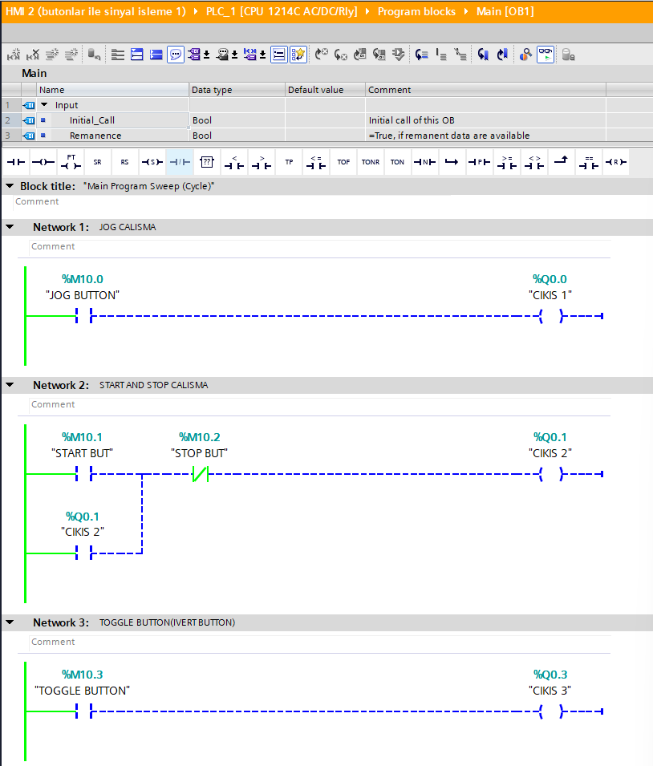
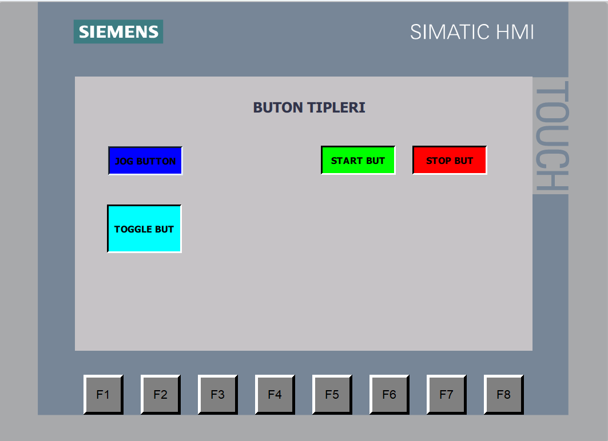
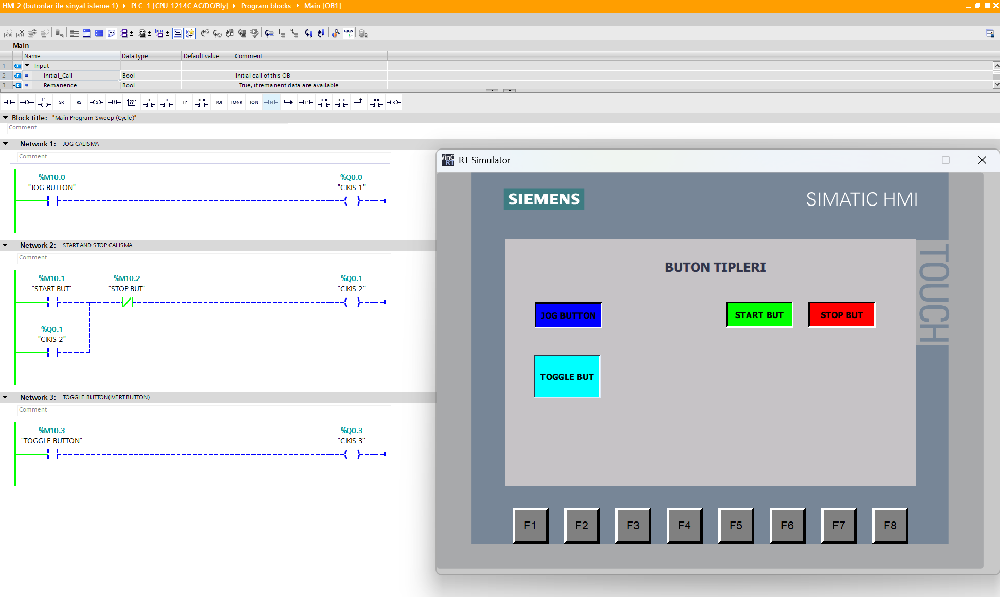

# PLC & HMI Buton Kontrolü

Bu projede Siemens S7-1200 PLC, TIA Portal V18 ve SIMATIC HMI kullanılarak Jog, Start/Stop ve Toggle buton kontrol uygulamaları gerçekleştirilmiştir.

## Kullanılan Teknolojiler

- Siemens S7-1200 PLC
- TIA Portal V18
- Ladder (LAD)
- SIMATIC HMI
- HMI Runtime Simulation

## Proje İçeriği

### Jog Buton Kontrolü

Jog butonuna basılı tutulduğu sürece ilgili PLC çıkışı aktif olmaktadır. Buton bırakıldığında çıkış pasif duruma geçmektedir.

### Start/Stop Kontrolü

Start butonuna basıldığında çıkış aktif edilir ve mühürleme mantığı ile çalışma durumu korunur. Stop butonuna basıldığında mühürleme bozulur ve çıkış pasif duruma geçer.

### Toggle Buton Kontrolü

HMI üzerinde bulunan Toggle buton ile ilgili PLC biti kontrol edilerek çıkışın aktif/pasif durumu yönetilmektedir.

## PLC Ladder Programı

Jog, Start/Stop ve Toggle butonlarına ait Ladder programı aşağıda gösterilmektedir.

## HMI Ekranı

Operatör kontrolü için Jog, Start, Stop ve Toggle butonlarından oluşan HMI ekranı tasarlanmıştır.

## PLC ve HMI Simülasyonu

PLC Ladder programı ile HMI Runtime birlikte çalıştırılarak buton kontrolleri test edilmiştir.

### Start Aktif Durumu

Start butonuna basıldığında mühürleme devresinin aktif durumu PLC Ladder ve HMI Runtime üzerinden gözlemlenmiştir.

## Proje Dosyası

Repository içerisinde TIA Portal V18 ile oluşturulmuş `.zap18` proje arşivi bulunmaktadır.
